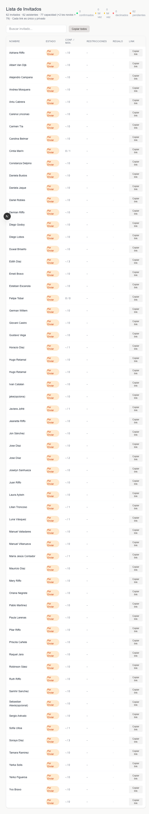

# Matri

Aplicación de invitaciones de matrimonio construida con Next.js, React, Notion y Mercado Pago. El proyecto genera una experiencia personalizada por invitado, permite confirmar asistencia, registrar restricciones alimentarias, aportar un regalo y revisar el estado de todos los invitados desde una vista de administración.

## Capturas

### Portada


### Invitación personalizada


### Acceso al panel admin



## Cómo funciona

La app está conectada a Notion, que actúa como fuente de verdad para los datos de la boda y de los invitados.

### Flujo principal

1. La portada carga la información general de la boda desde Notion.
2. Cada invitado entra a su enlace privado en la ruta /invitacion/[guestId].
3. La página consulta /api/guest/[id] para combinar datos del invitado con la información global del evento.
4. El invitado puede confirmar asistencia o declinar. Esa información se guarda en Notion a través de /api/confirm.
5. Si confirma, también puede registrar restricciones o preferencias de menú.
6. Si quiere hacer un regalo, la app crea una preferencia de pago en Mercado Pago mediante /api/gift.
7. Cuando Mercado Pago confirma un pago, el webhook /api/webhook/mercadopago actualiza el regalo asociado en Notion.
8. El panel /admin muestra el estado de todos los invitados y permite copiar sus links privados.

### Secciones visibles para el invitado

- Hero con nombres de los novios, mensaje y acceso al mapa.
- Bloque personalizado con el nombre del invitado y sus acompañantes.
- Detalles del evento: vestimenta, transporte y horarios.
- RSVP con estados Confirmado, Tal vez o Declinado.
- Selección de restricciones alimentarias.
- Lista de regalos con montos predefinidos o monto libre.

## Stack

- Next.js 16 con App Router.
- React 19.
- Tailwind CSS 4.
- Notion API como backend liviano para contenido e invitados.
- Mercado Pago para regalos.

## Estructura útil del proyecto

- app/page.tsx: portada pública.
- app/invitacion/[guestId]/page.tsx: invitación personalizada por invitado.
- app/admin/page.tsx: panel de administración.
- app/api/guest/[id]/route.ts: entrega datos del invitado y de la boda.
- app/api/confirm/route.ts: guarda confirmación y restricciones.
- app/api/gift/route.ts: crea el checkout de Mercado Pago.
- app/api/webhook/mercadopago/route.ts: confirma pagos y actualiza el regalo en Notion.
- lib/notion.ts: lectura y escritura de datos en Notion.
- lib/mercadopago.ts: creación de preferencias de pago.

## Variables de entorno

Este proyecto necesita un archivo .env.local con al menos estas variables:

```env
NOTION_TOKEN=
NOTION_WEDDING_PAGE_ID=
NOTION_GUESTS_DB_ID=
ADMIN_PASSWORD=
MERCADOPAGO_ACCESS_TOKEN=
MERCADOPAGO_WEBHOOK_SECRET=
MERCADOPAGO_SANDBOX=true
BASE_URL=http://localhost:3000
```

### Qué hace cada variable

- NOTION_TOKEN: token de integración de Notion.
- NOTION_WEDDING_PAGE_ID: id de la página con la información general del matrimonio.
- NOTION_GUESTS_DB_ID: id de la base de datos de invitados.
- ADMIN_PASSWORD: contraseña del panel admin.
- MERCADOPAGO_ACCESS_TOKEN: credencial para crear pagos.
- MERCADOPAGO_WEBHOOK_SECRET: valida la firma del webhook si está configurado.
- MERCADOPAGO_SANDBOX: fuerza modo sandbox cuando vale true.
- BASE_URL: URL pública o local usada por fetch internos y retornos de Mercado Pago.

## Cómo usarlo localmente

### 1. Instalar dependencias

```bash
npm install
```

### 2. Configurar entorno

Crea o completa .env.local con las variables indicadas arriba.

### 3. Levantar el proyecto

```bash
npm run dev
```

Abre http://localhost:3000.

## Cómo usar la app

### Vista pública

- Portada: http://localhost:3000
- Invitación por invitado: http://localhost:3000/invitacion/[guestId]

El guestId corresponde al id de la página del invitado en Notion. También puedes obtener ese link desde el panel admin.

### Panel de administración

- URL: http://localhost:3000/admin
- Acceso: ingresar la contraseña definida en ADMIN_PASSWORD

Desde el panel puedes:

- Buscar invitados por nombre.
- Ver estado de confirmación.
- Ver cantidad confirmada versus cupo.
- Revisar restricciones alimentarias.
- Ver si ya existe un regalo registrado.
- Copiar uno o todos los links privados.

## Modelo de datos esperado en Notion

### Página de la boda

Se esperan propiedades como:

- Nombre Novio
- Nombre Novia
- Fecha
- Hora
- Lugar
- Dirección
- Vestimenta
- Alojamiento y transporte
- Horarios
- Mensaje
- URL Mapa
- Foto Portada
- Montos Regalo

### Base de invitados

Se esperan propiedades como:

- Nombre
- Email
- Teléfono
- Estado de confirmación
- Número de acompañantes
- acompañantes confirmados
- Quiénes vienen
- Restricciones alimentarias
- Regalo

Además, los nombres de acompañantes se leen desde los comentarios de la página del invitado.

## Flujo de regalos

1. El invitado selecciona un monto en la sección de regalos.
2. La app llama a /api/gift.
3. Se crea una preferencia en Mercado Pago con el guestId como external_reference.
4. Mercado Pago redirige al usuario al checkout.
5. El webhook recibe la confirmación del pago.
6. Si el pago está aprobado, se actualiza la propiedad Regalo del invitado en Notion.

## Scripts disponibles

```bash
npm run dev
npm run build
npm run start
npm run lint
```

## Notas operativas

- Los links de invitación son privados y únicos por invitado.
- La autenticación del panel admin usa una cookie simple de sesión.
- Si falta configuración de Notion o Mercado Pago, algunas secciones pueden quedar sin datos o fallar al guardar.
